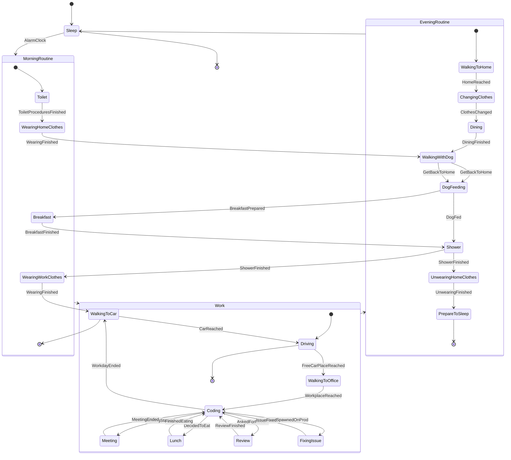

## Finite state automata for my day

```mermaid
stateDiagram
    [*] --> Sleep
    Sleep --> MorningRoutine : AlarmClock
    MorningRoutine --> Work
    Work --> EveningRoutine
    EveningRoutine --> Sleep
    Sleep --> [*]

    state MorningRoutine {
        [*] --> Toilet
        Toilet --> WearingHomeClothes : ToiletProceduresFinished
        WearingHomeClothes --> WalkingWithDog : WearingFinished
        WalkingWithDog --> DogFeeding : GetBackToHome
        DogFeeding --> Breakfast : BreakfastPrepared
        Breakfast --> Shower : BreakfastFinished
        Shower --> WearingWorkClothes : ShowerFinished
        WearingWorkClothes --> WalkingToCar : WearingFinished
        WalkingToCar --> [*]
    }
    state Work {
        [*] --> Driving
        Driving --> WalkingToOffice : FreeCarPlaceReached
        WalkingToOffice --> Coding : WorkplaceReached
        Coding --> Meeting : MeetingStarted
        Meeting --> Coding : MeetingEnded
        Coding --> Lunch : DecidedToEat
        Lunch --> Coding : FinishedEating
        Coding --> Review : AskedForReview
        Review --> Coding : ReviewFinished
        Coding --> FixingIssue : IssueSpawnedOnProd
        FixingIssue --> Coding : IssueFixed
        Coding --> WalkingToCar : WorkdayEnded
        WalkingToCar --> Driving : CarReached
        Driving --> [*]
     }
    state EveningRoutine {
        [*] --> WalkingToHome
        WalkingToHome --> ChangingClothes : HomeReached
        ChangingClothes --> Dining : ClothesChanged
        Dining --> WalkingWithDog : DiningFinished
        WalkingWithDog --> DogFeeding : GetBackToHome
        DogFeeding --> Shower : DogFed
        Shower --> UnwearingHomeClothes : ShowerFinished
        UnwearingHomeClothes --> PrepareToSleep : UnwearingFinished
        PrepareToSleep --> [*]
    }
```